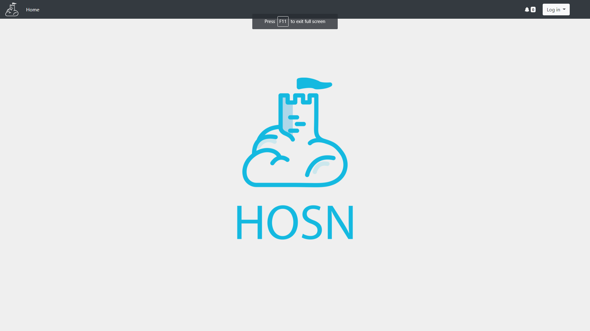
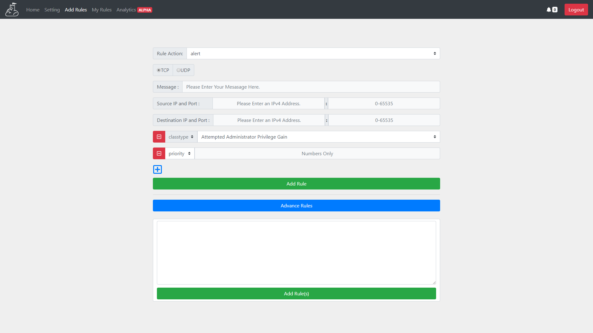
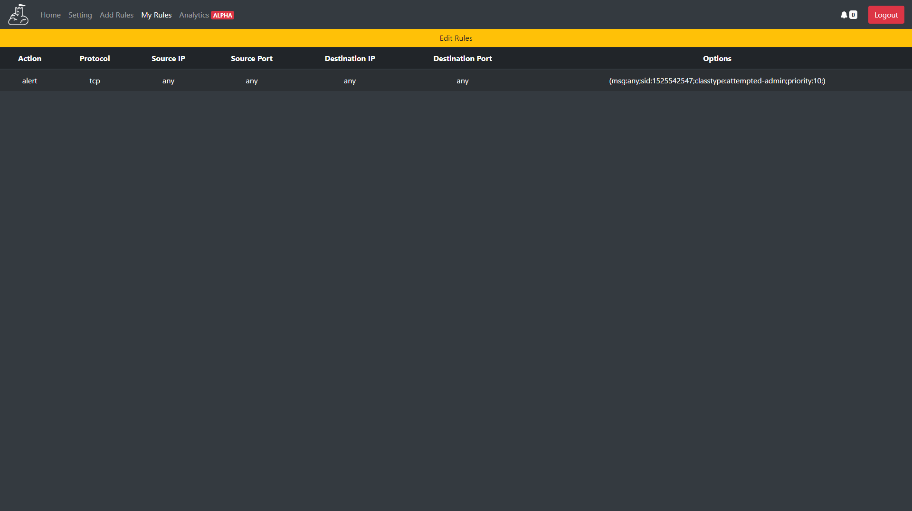
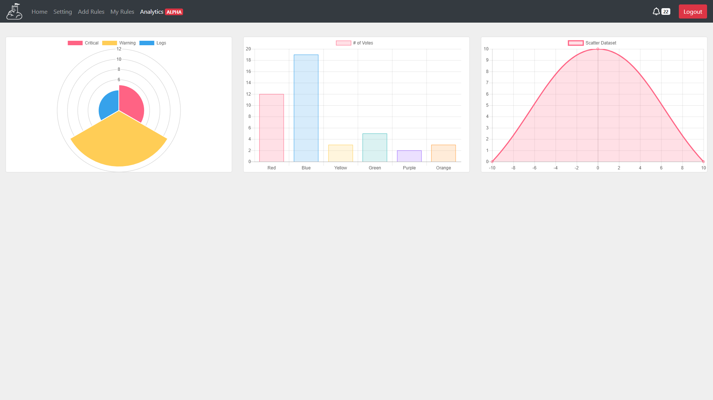
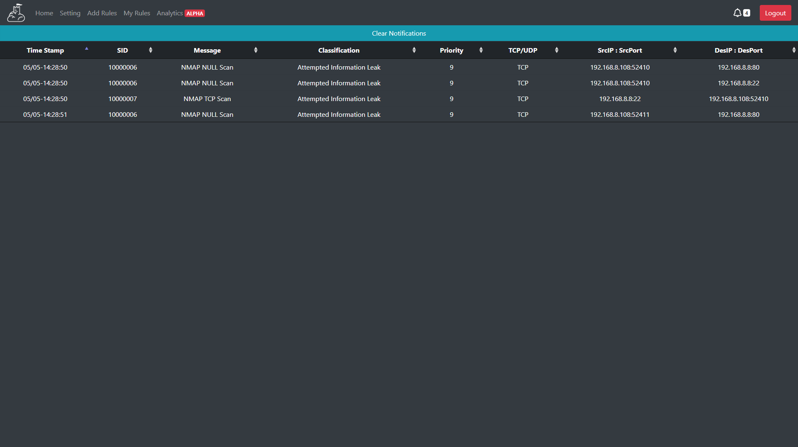

<p align="center"> 
  
</p>

# Introduction
HOSN is a project that interacts with Snort very easily where it allows you to add rules using well-designed forms, it can display Snort logs in very easy way to read and it provides an analytics page that analyze the logs generated by Snort and show some useful information such as how much critical and warnings logs. HOSN is designed and tested to work on Raspberry Pi. Its purpose is to make Snort Plug and play on small network.
# Goals and Objectives
*	Provide more security to the wireless networks using a powerful open source IDS/IPS tool called Snort.
*	Provide a tool to manage, add and monitor snort (GUI interface).
*	Provide an IDS/IPS on an affordable plug and play devices for small network.
# Installation
The installation of the project is very simple. We coded a script in bash that will to that for you, all you need to do is just to run the script as root. 
#### First give the script execurion privileges:
```
$ sudo chmod +x INSTALL_DEB.sh
```
#### Then run the script as **`root`**:
```
$ sudo ./INSTALL_DEB.sh
```
After that follow the instructions to configre Snort and MYSQL such as the default Snort inteface and MySQL root user password.
After the installation has complete you still have to do one more thing which is enabling `www-data` user to run `snort,reboot and killall` as **`root`** by adding a rule to the `/etc/sudoers` file. We did not add this step to the installation script because it depends on the distros you’re using. If you are using any other distro other than ubuntu look how to change the file correctly because **IT WILL BREAK YOU SYSTEM** if you mistyped.

#### However, if you’re using ubuntu then follow the following steps:
1.  Run the command `sudo visudo` then enter your password.
2.  Then go to end of the file and type the following:
```
www-data	ALL=(ALL) /usr/sbin/snort, /usr/bin/killall, /sbin/reboot
```
3.  Save and exit.
You successfully installed HOSN and it should be up and running, However if you need the access point you should also run a script called `INSTALL_ACCESSPOINT.sh`. Follow the below steps to do so:
1.  Give execute privilage to the script by running `sudo chmod +x INSTALL_ACCESSPOINT.sh`.
2.  Then run the script `sudo ./INSTALL_ACCESSPOINT.sh`.

After the instlation the project will work as IDS only if you want it to work as IPS simple just excute the script called `IDSorIPS.sh` by following the steps:
1.  Give the script execute privileges by executing `sudo chmod +x IDSorIPS.sh`.
2.  Then execute the script by typing `sudo ./IDSorIPS.sh`.
3.  After that choose an option (1 for IDS or 2 for IPS) then press **ENTER**.

If you pressed *2* then you will be asked to Enter two interfaces formated as follow `Interface1:Interface2`.
That is it ! If you want to change from IDS to IPS or visa versa just use the script again. 

# Team Members
AbdulRhman Alfaifi
[[Twitter][1] , Email: abdulrhmanalfaifi@outlook.com]

Yahya Alfaifi
[[Twitter][2] , Email: yahyaalfaifi1414@gmail.com , [CV][3]]

# NOTE
HOSN is still in development so becareful when using it. If you found any bugs or you have suggestions please feel free to contact us. Thanks !

# Screenshots

<p align="center">
  
  
  
  
  
</p>

[1]:https://twitter.com/A__ALFAIFI
[2]:https://twitter.com/IyahyaC
[3]:http://yahyaalfaifi.com/
